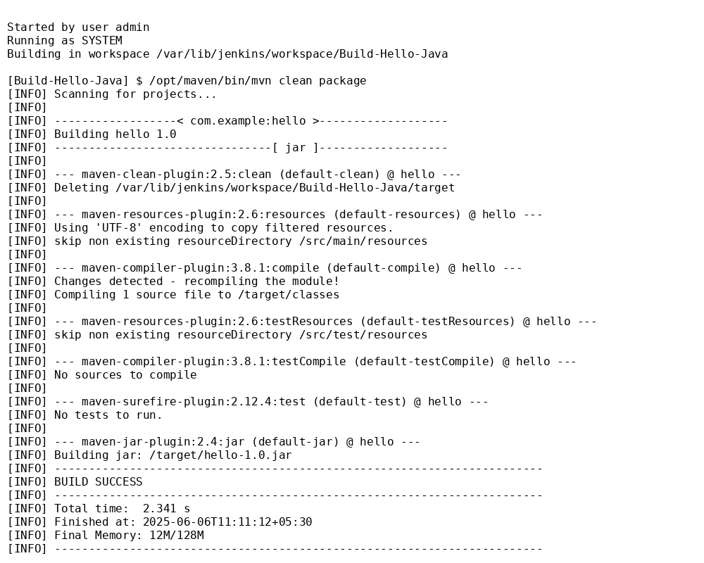

Java Maven Build Job in Jenkins

  Objective

The goal of this task was to understand how Jenkins can be used to build a simple Java application using Maven. This is a foundational CI/CD task that helps automate Java builds.


🔧 Tools Used

- 🐳 Jenkins (via Docker)
- ☕ Java JDK 8
- 📦 Apache Maven
- 🧑‍💻 Git & GitHub


 📂 Project Structure

```

hello-java-maven/
├── pom.xml
├── README.md
├── screenshot.png
└── src/
└── main/
└── java/
└── HelloWorld.java

````


🧠 What I Did

1. ✅ Created a simple Java application with a `HelloWorld` class.
2. ✅ Wrote a `pom.xml` to define Maven project structure.
3. ✅ Ran Jenkins locally using Docker with:
   ```bash
   docker run -p 8080:8080 jenkins/jenkins:lts
````

4. ✅ Installed Maven inside Jenkins using **Global Tool Configuration**.
5. ✅ Created a **Freestyle Job** named `Build-Hello-Java`.
6. ✅ Configured the build step to run:

   ```
   clean package
   ```
7. ✅ Triggered the build manually in Jenkins.
8. ✅ Verified the console output with `BUILD SUCCESS`.
9. ✅ Captured a screenshot of the successful build.
10. ✅ Pushed the project to GitHub with all required files.

````

 🖥 Output Screenshot

 Below is the  console output from Jenkins showing `BUILD SUCCESS`:




